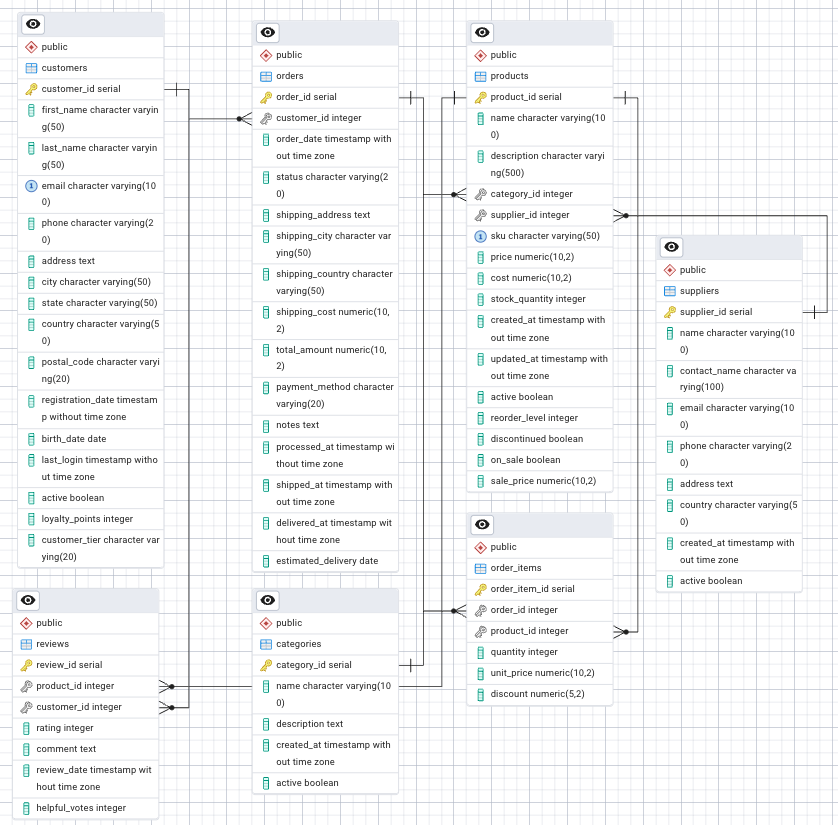

# E-commerce Analytics Platform

A PostgreSQL database designed to model and analyze customer behavior, order patterns, and product performance in an e-commerce business.

## Database Schema



The database consists of 7 interconnected tables:
- **Customers**: Customer profile data and purchasing history
- **Products**: Product information with pricing and inventory
- **Orders**: Customer order information with status tracking
- **Order_Items**: Line items and product details for each order
- **Reviews**: Customer product reviews and ratings
- **Suppliers**: Product vendor information
- **Categories**: Product category hierarchy

## Implementation Details

### Database Creation & Schema Management
- [Table Creation Scripts](./schema/01-create-tables.sql): Seven properly related tables with constraints
- [Schema Evolution](./schema/02-alter-tables.sql): Examples of schema modifications
- [Indexing Strategy](./schema/03-create-indexes.sql): Performance optimization indexes
- [Dropping Tables](./schema/04-drop-tables.sql): Table dropping sequence
- [Reporting Views](./schema/05-create-views.sql): Creating views

### Sample Queries

#### Basic SELECT Query
```sql
-- Example of a basic SELECT query with filtering
SELECT product_name, price, stock_quantity
FROM products
WHERE category_id = 3 AND price < 50.00
ORDER BY price DESC;
```
#### Multi-table Join Example
```sql
-- Join multiple tables to analyze customer purchases
SELECT c.first_name, c.last_name, p.name AS product_name, 
       oi.quantity, oi.unit_price, o.order_date
FROM customers c
JOIN orders o ON c.customer_id = o.customer_id
JOIN order_items oi ON o.order_id = oi.order_id
JOIN products p ON oi.product_id = p.product_id
WHERE o.order_date > '2023-01-01'
ORDER BY o.order_date DESC;
```

### Future Enhancements

#### Planned improvements:
- Implementing stored procedures for common operations
- Adding time-based analysis capabilities
- Creating a reporting dashboard

#### Business Insights
- Customer purchasing patterns by geography
- Product category performance analysis
- Order fulfillment efficiency metrics